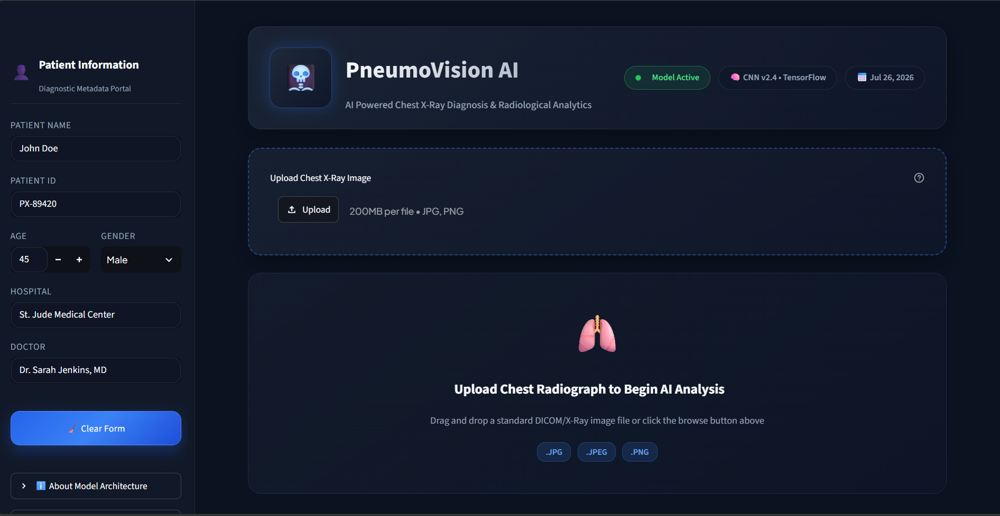
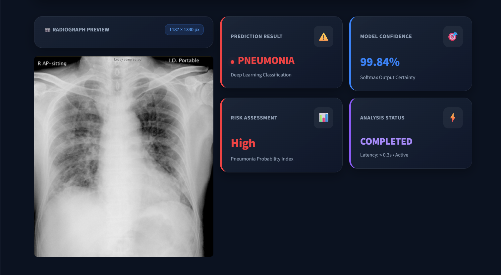
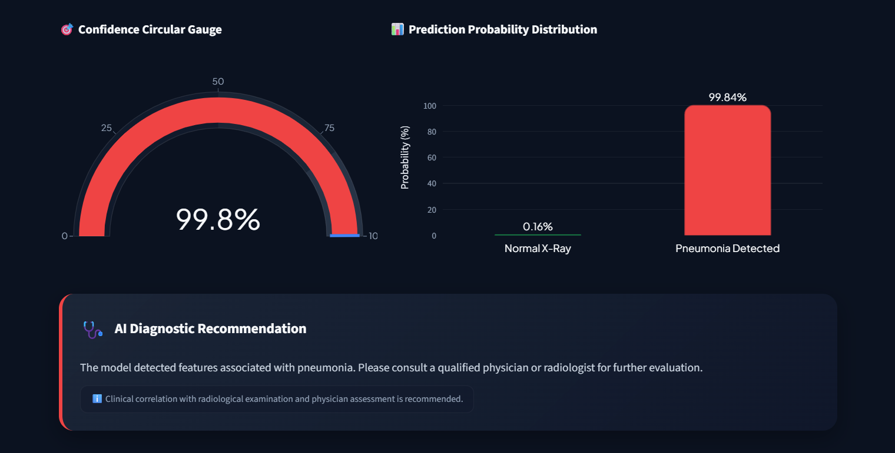
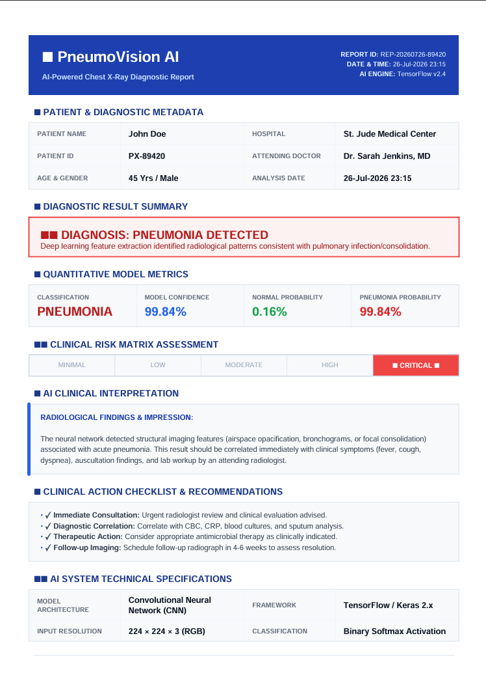

# 🩻 Chest X-Ray Pneumonia Detection AI

A Deep Learning-based web application that detects **Pneumonia** from Chest X-Ray images using a **Convolutional Neural Network (CNN)** built with **TensorFlow/Keras**. The application provides an interactive clinical dashboard developed with **Streamlit**, displaying prediction probabilities, confidence scores, patient information, and downloadable AI-generated diagnostic reports.

> **Note:** This project is intended for **educational and research purposes only** and is **not** a substitute for professional medical diagnosis.

---

## 🚀 Features

- 🩻 **Chest X-Ray Classification**
  - Binary classification of Chest X-Ray images
  - Detects:
    - ✅ Normal
    - 🦠 Pneumonia

- 🤖 **Deep Learning CNN**
  - Built using TensorFlow/Keras
  - Image preprocessing and normalization
  - Binary classification using Sigmoid activation

- 📊 **Prediction Dashboard**
  - Prediction result
  - Confidence score
  - Normal probability
  - Pneumonia probability
  - Risk assessment

- 👤 **Patient Information**
  - Patient Name
  - Patient ID
  - Age
  - Gender
  - Hospital
  - Doctor

- 📈 **Interactive Probability Chart**
  - Built using Plotly
  - Displays prediction probabilities visually

- 📄 **PDF Report Generation**
  - AI-generated diagnostic report
  - Includes patient information
  - Prediction summary
  - Confidence score
  - Probability values
  - AI recommendation

- 🌙 **Modern Streamlit UI**
  - Responsive layout
  - Dark theme
  - Interactive dashboard

---

## 📸 Dashboard



---

## 🩻 AI Prediction Dashboard



---

## 📊 Prediction Analytics



---

## 📄 AI Diagnostic Report



# 📸 Application Workflow

```text
Chest X-Ray Image
        │
        ▼
 Image Preprocessing
        │
        ▼
 TensorFlow CNN Model
        │
        ▼
Prediction
        │
        ▼
Probability Analysis
        │
        ▼
Risk Assessment
        │
        ▼
PDF Report Generation
```

---

# 🏗️ Project Structure

```text
Pneumonia-Detection-AI/
│
├── app.py
├── README.md
├── requirements.txt
├── x_ray.ipynb
├── .gitignore
│
├── utils/
│   ├── helpers.py
│   ├── preprocess.py
│   ├── predict.py
│   └── report.py
│
├── assets/
│   ├── dashboard.png
│   └── prediction.png
│
└── pneumonia_model.keras
```

> If `pneumonia_model.keras` is not included, download it separately and place it in the project root.

---

# 🛠️ Tech Stack

## Deep Learning

- TensorFlow
- Keras

## Computer Vision

- OpenCV
- Pillow (PIL)

## Web Framework

- Streamlit

## Visualization

- Plotly
- Matplotlib

## Data Processing

- NumPy
- Pandas

## PDF Generation

- ReportLab

---

# 🧠 CNN Architecture

```text
Input Image (224 × 224 × 3)

        │
        ▼

Conv2D (32 Filters)

        │
        ▼

MaxPooling2D

        │
        ▼

Conv2D (64 Filters)

        │
        ▼

MaxPooling2D

        │
        ▼

Flatten

        │
        ▼

Dense (128 Units)

        │
        ▼

Dense (1 Unit - Sigmoid)

        │
        ▼

Prediction
```

---

# 📊 Model Output

The model predicts:

| Prediction | Description |
|------------|-------------|
| Normal | Chest X-Ray appears normal |
| Pneumonia | Features associated with pneumonia detected |

The application also displays:

- Confidence Score
- Normal Probability
- Pneumonia Probability
- Risk Level
- AI Recommendation

---

# 📂 Dataset

The model was trained using a labelled Chest X-Ray image dataset containing two classes:

- Normal
- Pneumonia

All images are resized to:

```text
224 × 224 × 3
```

before inference.

---

# ⚙️ Installation

## 1. Clone the Repository

```bash
git clone https://github.com/Shaipratt51/Pneumonia-Detection-AI.git
```

---

## 2. Navigate to the Project

```bash
cd Pneumonia-Detection-AI
```

---

## 3. Create a Virtual Environment (Optional)

### Windows

```bash
python -m venv venv
venv\Scripts\activate
```

### Linux / macOS

```bash
python3 -m venv venv
source venv/bin/activate
```

---

## 4. Install Dependencies

```bash
pip install -r requirements.txt
```

---

## 5. Run the Application

```bash
streamlit run app.py
```

The application will open at:

```text
http://localhost:8501
```

---

# 📝 How to Use

1. Launch the Streamlit application.
2. Enter patient information.
3. Upload a Chest X-Ray image.
4. Wait for the model prediction.
5. Review:
   - Prediction
   - Confidence
   - Probability chart
   - Risk level
   - AI recommendation
6. Download the generated PDF report.

---

# 📄 PDF Report Includes

- Patient Details
- Hospital Information
- Doctor Name
- Prediction
- Confidence Score
- Normal Probability
- Pneumonia Probability
- Risk Level
- AI Recommendation

---

# 📦 Requirements

```text
tensorflow
streamlit
opencv-python
numpy
pandas
matplotlib
plotly
pillow
reportlab
```

Install using:

```bash
pip install -r requirements.txt
```

---

# 📈 Future Improvements

- Multi-class lung disease detection
- Tuberculosis detection
- COVID-19 detection
- DICOM image support
- Cloud deployment
- User authentication
- Patient history management
- Model monitoring dashboard

---

# 📊 Performance

The model uses:

- Convolutional Neural Network (CNN)
- Binary Cross-Entropy Loss
- Adam Optimizer
- Sigmoid Activation

Evaluation metrics include:

- Accuracy
- Prediction Probability
- Confidence Score

---

# 📥 Model File

The trained model (`pneumonia_model.keras`) may not be included in this repository because it exceeds GitHub's file size limit.

If unavailable, place the trained model file in the project root:

```text
Pneumonia-Detection-AI/
│
├── pneumonia_model.keras
```

---

# ⚠️ Medical Disclaimer

This project is intended **solely for educational and research purposes**.

The predictions generated by this AI system should **NOT** be considered a medical diagnosis or used as a substitute for professional medical advice, diagnosis, or treatment.

Always consult a qualified physician or radiologist for clinical decisions.

---
